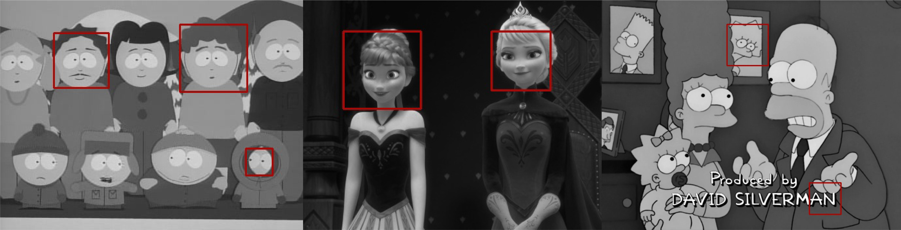

# Cartoon face-off: Detecting human cartoon characters using Viola-Jones

We observe how the Viola-Jones face detection algorithm performs on "non-human human" faces, i.e. cartoon characters. Our data consists of screenshots from three cartoons with very different drawing styles: Frozen, The Simpsons and South Park. We evaluate our detections using Intersection over Union (IoU) and also by counting misdetections and correct detections compared to number of all faces in the dataset. In the end we also try to enhance the detector by combining the Viola-Jones face and eye classifier.

#### Requirements
- Anaconda Python Distribution, Python 3.7.4, installed from: [https://www.anaconda.com/distribution/](https://www.anaconda.com/distribution/).
- R version 3.6.1, installed from: [https://www.r-project.org/](https://www.r-project.org/).

#### Environment setup
- Setup the environment using environment.yml file you find in the directory: `conda env create -f environment.yml`.
- Activate the environment: `conda activate cartoon-face-detection`.

#### Folder structure

    .
    ├── data                    
    │   ├── raw         		# screenshots in cartoon subfolders
    │   └── test                # preprocessed images in cartoon subfolders, annotation json files
    ├── output                  # detection output in cartoon subfolders, results json file, plots
    ├── src                    	# Python and R scripts
    ├── environment.yml			# conda environment file
    ├── example.png
    └── README.md

#### Run experiments
Run `script.py` to obtain detections. The script will take care of preprocessing, detection and will also evaluate the detections. Its output is a json file `results.json` containing Intersection over Union (IoU) values for each of the input images.

Before running the script, user can change the following parameters:  

- `cartoons` **list** List of cartoons we want to use in our experiment.  
- `max_width` **integer** Maximum width for the input images in px or `None` if you don't want to resize the images.  
- `rgb2gray` **boolean** True if you want to convert the input images to grayscale.   
- `use_combined_detection` **boolean** True if you want to use our combined VJ detector.  
- `save_faces` **boolean** True if you want to draw the detections on the images and save them.  

#### Analyze results
Result analysis is done by three R scripts:  

- `IoU_analysis.R`: reads `results.json`, bootstraps the IoU values for each cartoon, plots 95% bootstrap percentile confidence intervals, saves the plot.  
- `count_detections_analysis.R`:  reads `{cartoon}_table.csv` files, which we made manually by counting detections from our output images. Plots number of misdetections and number of correct detections compared to number of all faces in the dataset per cartoon, saves the plot.  
- `vj_combo_analysis.R`: reads `frozen_table.csv` and `frozen_table_2.csv` (file, made manually by counting detections if we used the combined VJ detector). Plots a barplot for detector comparison, saves plot.

To run the scripts set the value of variable `path` (first line in all scripts) to path to your project root directory. Project directory structure is assumed to stay the same.